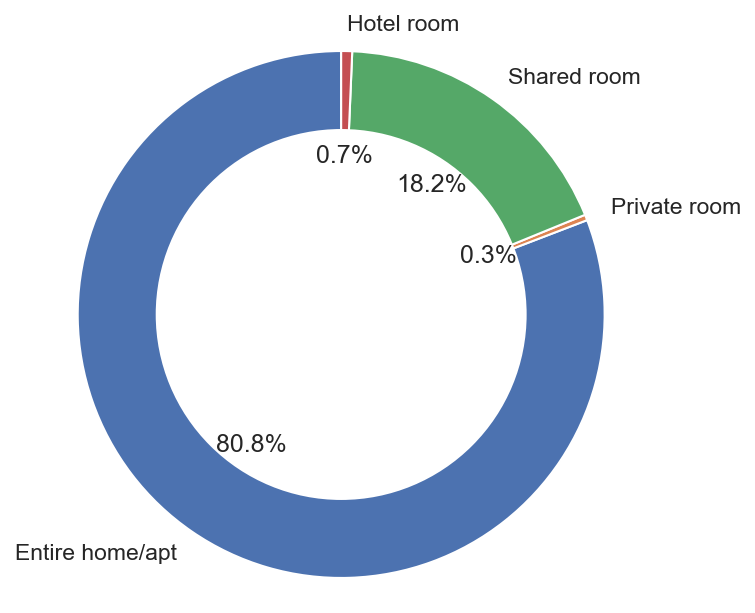
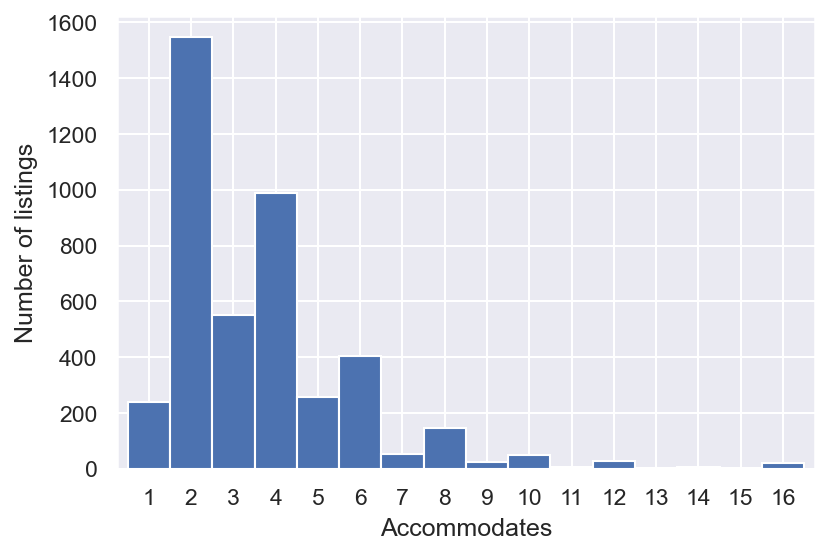
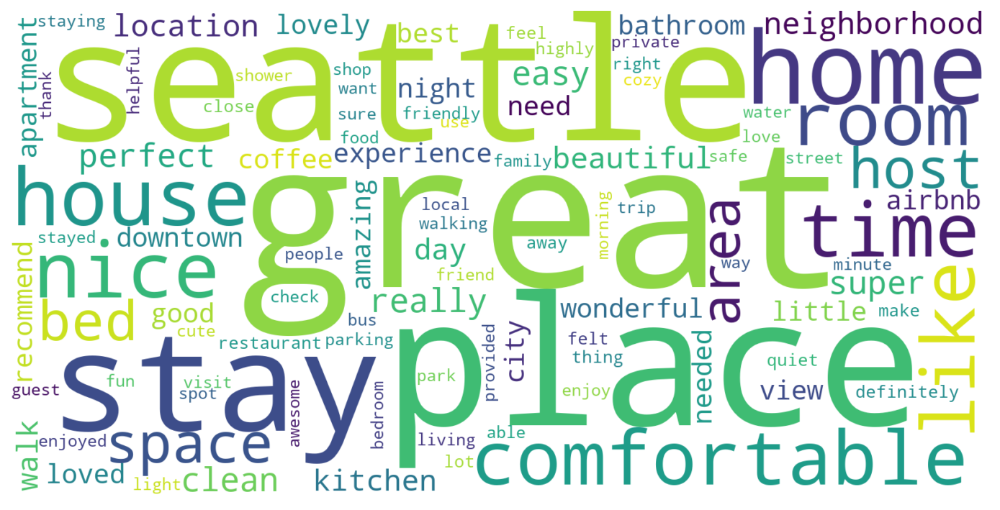
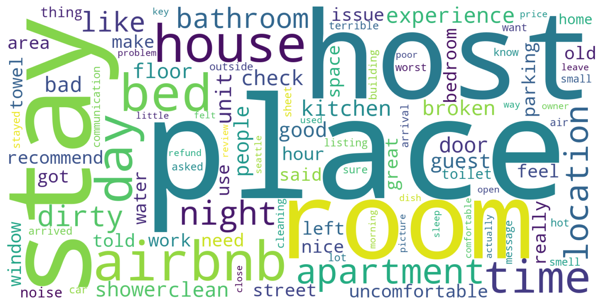

Known as the "Emerald City", Seattle attracts thousands of tourists every year to visit. With more than 4000 listings in the city, Airbnb has interwoven with the rental landscape since its inception in 2008. In this post, I'll be focusing on using interactive data visualization and text mining tools to explore a few key insights of the lastest Seattle Airbnb market. Given the open source Seattle Airbnb data from [Inside Airbnb](http://insideairbnb.com/get-the-data.html), I attempt to answer the following business questions from three aspects:

* Location impact on Seattle Airbnb market
    + Where are the listings located and what are the average prices of these listings by neighbourhood?
* Advice for tourists 
    + What is the availability of the accommodations and what is the price trend in the near future?
* Insights for hosts
    + What do tourists like about their accommodations and what do they usually complain about if they had a bad experience?

The analysis provided here gives a general overview of the Airbnb market in Seattle, and can also serve as a guide to the future visitors.

## Overview

* **[Data exploration](#data-exploration)**
    + [Locations on the map](#locations-on-the-map)
    + [Room types](#room-types)
    + [Accommodates](#accommodates)
* **[Location impact on Seattle Airbnb market](#location-impact-on-seattle-airbnb-market)**
    + [Number of listings by neighbourhood](#number-of-listings-by-neighbourhood)
    + [Average daily prices by neighbourhood](#average-daily-prices-by-neighbourhood)
* **[Advice for tourists](#advice-for-tourists)**
    + [Availability over the time](#availability-over-the-time)
    + [Average daily prices by date](#average-daily-prices-by-date)
* **[Insights for hosts](#insights-for-hosts)**
    + [Text mining of review comments](text-mining-of-review-comments)
    
## Data exploration

Before we dig into the answers to the above questions, let's conduct a brief explorary data analysis to gain a sense of the primary locations, room types and accommodation of the listings in Seattle. 

### Locations on the map

<iframe src="listing_locations.html" style="display: block; width:100%; height: 400px">
</iframe>

As expected, most listings are located in the center area of the city. This map is interactive, and we can zoom-in on the clusters to eventually find the individual locations of the listings. 

### Room types

{width=50%}

In Seattle, a majority of Airbnb listings is entire home/apartment. The listings for private room and hotel room are very rare.

### Accommodates

{width=55%}
It can be seen that most listings are for 2 people.

## Location impact on Seattle Airbnb market
```python
# load the neighbourhood information
nbh_geo = gpd.read_file('neighbourhoods.geojson', driver='GeoJSON')

# calculate the number of listings by neighbourhood
nbh_count = listings_df.groupby('neighbourhood_cleansed')['id'].nunique().reset_index()
nbh_count.rename(columns={'neighbourhood_cleansed':'neighbourhood'}, inplace=True)
nbh_geo_count = pd.merge(nbh_geo, nbh_count, on='neighbourhood', how='left')
nbh_geo_count['id'] = nbh_geo_count['id'].fillna(0).astype(int)

# calculate the percentage of listings by neighbourhood
nbh_geo_count['pct'] = nbh_geo_count['id'] / nbh_geo_count['id'].sum()
nbh_geo_count['pct_str'] = nbh_geo_count['pct'].apply(lambda x : str(round(x*100, 1)) + '%')

# create a colorbar
nbh_count_colormap = branca.colormap.linear.YlGnBu_09.scale(min(nbh_geo_count['id']), max(nbh_geo_count['id']))

nbh_locs_map = folium.Map(location=seattle_coordinates, zoom_start=11, tiles='cartodbpositron')

style_function = lambda x: {
    'fillColor': nbh_count_colormap(x['properties']['id']),
    'color': 'white',
    'weight': 1,
    'fillOpacity': 0.7
}

nbh_locsNb = folium.GeoJson(
    nbh_geo_count,
    style_function=style_function,
    tooltip=folium.GeoJsonTooltip(
        fields=['neighbourhood', 'id', 'pct_str'],
        aliases=['Neighbourhood', 'Listings', 'Percentage'],
        localize=True
    )
).add_to(nbh_locs_map)

# add the colorbar to the map
nbh_count_colormap.add_to(nbh_locs_map)
nbh_count_colormap.caption = 'Number of listings by neighbourhood'
```

<iframe src="neighbourhood_listings.html" style="display: block; width:100%; height: 400px">
</iframe>

The spatial distribution of listings shows listings are concentrated in two areas. One is Belltown-Center Business District-Broadway neighbourhoods, which represents the downtown area. The other one is the Wallingford-University District area, which includes the campus of University of Washington (UW). Both downtown area and UW campus are attractive choices for tourists to visit.

### Average daily price by neighbourhood

To compare average daily price by neighbourhood, we only select the neighbourhoods including at least 5 listings with the most common type of accommodation, which is accommodation for 2 people

<iframe src="neighbourhood_prices.html" style="display: block; width:100%; height: 400px">
</iframe>

It can be seen that the costliest neighbourhoods are also in the downtown area due to high demand, while the average rental prices of UW campus area are far cheaper. Other relatively expensive places, such as West Woodland and North Beach/Blue Ridge are waterfront neighbourhoods. 

## Advice for tourists

### Availability over time

```python
# calculate the sum of available listings by date
sum_available = calendar_df[calendar_df['available'] == 't'] \
                .groupby(['date']).size().to_frame(name='available').reset_index()
# convert 'date' to 'weekday'
sum_available['date'] = pd.to_datetime(sum_available['date'])
sum_available['weekday'] = sum_available['date'].dt.day_name()

# plot the sum of available listings by date
fig = go.Figure(data=go.Scatter(x=sum_available['date'],
                                y=sum_available['available'],
                                text=sum_available['weekday']))

# set the layout
fig.update_layout(
    autosize=False,
    width=480,
    height=360,
    margin=dict(l=0, r=0, t=30, b=0),
    xaxis_title = 'Date',
    yaxis_title = 'Number of listings available'
)

fig.show()
```
<iframe src="availability_over_time.html" style="display: block; width:100%; height: 390px">
</iframe>

It shows that there are generally more accomodations available up to three months ahead than further into next year. Part of the reason might be that hosts are more actively updating their calendars in this timeframe. Besides, due to Seattle's rainy winter, most of people prefer to visit Seattle in summer or autumn instead.

### Average daily price by date

Again, in order to compare "apples to apples" regarding the prices, we will merge the "accomodates" column from the listings data with the calendar data. 

```python
# calculate the average price of a 2-person accommodation by date
listings_df.rename(columns={'id':'listing_id'}, inplace=True)
calendar_df = pd.merge(calendar_df, listings_df[['listing_id','accommodates']], on='listing_id', how='left')

average_price = calendar_df[(calendar_df['available'] == 't') & (calendar_df['accommodates'] == 2)] \
                .groupby(['date'])['price_clean'].mean().reset_index()
# convert 'date' to 'weekday'
average_price['date'] = pd.to_datetime(average_price['date'])
average_price['weekday'] = average_price['date'].dt.day_name()

# plot the average price of a 2-person accommodation by date
fig = go.Figure(data=go.Scatter(x=average_price['date'],
                                y=average_price['price_clean'],
                                text=average_price['weekday']))

# set the layout
fig.update_layout(
    autosize=False,
    width=480,
    height=360,
    margin=dict(l=0, r=0, t=30, b=0),
    xaxis_title = 'Date',
    yaxis_title = 'Average price of 2p accommodation'
)

fig.show()
```

<iframe src="average_2p_price_over_time.html" style="display: block; width:100%; height: 390px">
</iframe>

We find that the peak of average daily price for a 2-person place occurs on September 4 next year at about $132, and the cyclical pattern is due to higher prices in weekends.

## Insights for hosts

Last, we want to find out which housing properties (e.g., proximity of restaurants, shops, hygiene, safety, etc.) lead to a good rental experience, and explore some of the worst reviews. Here, we adopt a python package **VADER** which is a lexicon and rule-based sentiment analysis tool, to compute the polarity score of the comments. 

### Text mining of review comments
```python
def get_sentiment(text):
    '''Get the compound polarity score of a text 
    
    Args:
    text: (str) the text of a comment
    
    Returns:
    polarity_score: (float) the compound polarity score of the text
    '''
    polarity_score = SentimentIntensityAnalyzer().polarity_scores(str(text))['compound']
    
    return polarity_score

reviews_df['polarity_score'] = reviews_df['comments'].apply(get_sentiment)

# explore the worst reviews
worst_comments = reviews_df[['comments', 'polarity_score']].sort_values(by='polarity_score').head(5)
for index, row in worst_comments.iterrows():
    print("Review (score: {}): {} \n".format(row['polarity_score'], row['comments']))
```
From our initial sentiment analysis, we notice that:

* An overwhelming proportion of reviews are positive
* Polarity scores are correlated with the length of reviews. The more efforts one spends in writing a review, the more polarized score the review gets.
* Reviews with words in capital letters and exclamation signs are often rated more polarized.
* Reviews written in non-English seem to be rated badly on the polarity score. It may be a limitation of VADER

Now let's build a word cloud for the top 500 positive and negtive reviews, respectively, and see what the most frequently mentioned words are. 

```python
def plot_wordcloud(comments, output_filename, background_color='white', max_words=100):
    """Generate a word cloud image given a corpus of comments
    
    Args:
    comments: (iterable) a corpus of comments
    output_filename: (str) the output file name
    background_color: (str) background color for the word cloud image
    max_words: (int) the maximum number of words.
    
    Returns:
    None
    """
    features = tfidf.fit_transform(comments).toarray()
    df = pd.DataFrame(features.tolist(), columns=tfidf.get_feature_names())
    
    # generate word cloud
    wordcloud = WordCloud(background_color=background_color, max_words=max_words, width=1600, height=800) \
                .generate_from_frequencies(df.T.sum(axis=1))
    
    # display the generated image
    plt.figure(figsize=(12,6))
    plt.imshow(wordcloud, interpolation='bilinear')
    plt.axis('off')
    plt.savefig(output_filename + '.png', bbox_inches='tight', dpi=150)
    
# generate a word cloud for the positive comments
pos_comments = reviews_df[['comments','polarity_score']].sort_values(by='polarity_score')['comments'].tail(500)
plot_wordcloud(pos_comments, 'pos_wordcloud')
```
{width=70%}
It’s not surprising the top positive terms include:
**walk**, **restaurants**, **food**, **shop**, **bus**, **park**, **view**, **safe** and **quiet**.

```python
# generate a word cloud for the negative comments
neg_comments = reviews_df[['comments','polarity_score']].sort_values(by='polarity_score')['comments'].head(500)

# remove non-English comments
neg_comments_en = neg_comments[neg_comments.apply(detect) == 'en']
plot_wordcloud(neg_comments_en, 'neg_wordcloud')
```
{width=70%}
In contrast, the top negative terms include: **dirty**, **broken**, **noise**, **smell**, **old** and **small**. Besides, it seems the guests often have issues with amenities, such as **shower**, **door**, **towel**, **window**, **toilet** and **sheet**.

For more details about this analysis, see the link to my Github available [here](https://github.com/w-guo/Seattle-Airbnb-analysis).
