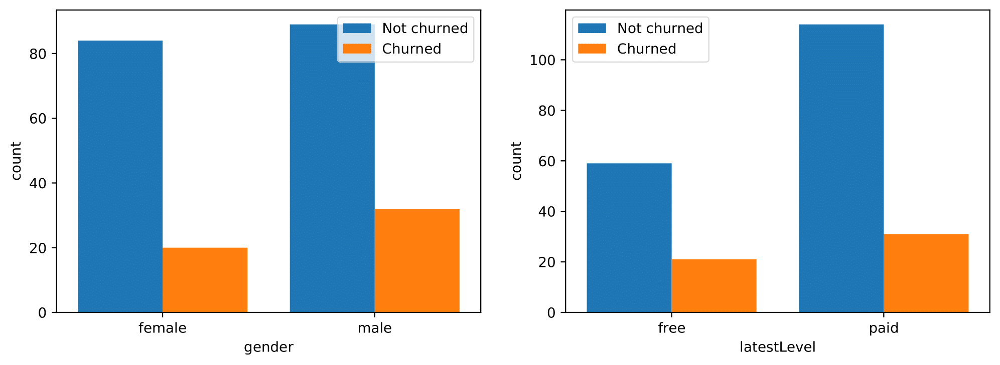
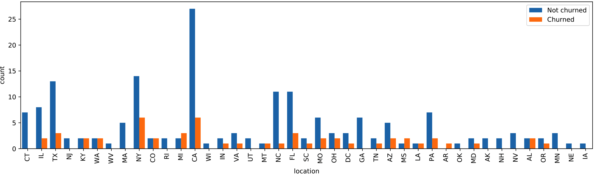

{width=100%}

Predicting customer churn is a challenging and common problem for any e-commerce business in which everything depends on the behavior of customers. Customer churn is often defined as the process in which the customers downgrade from premium to free tier or stop using the products or services of a business. Thus, the ability to predict which users are at risk of churning, while there is still time to offer them discounts or other incentives, will greatly help to prevent every custormer-facing business from suffering severe financial losses.

## Overview
* **[Data preparation](#data-preparation)**
    + [Data description](#data-description)
    + [Data cleaning](#data-cleaning)
* **[Feature engineering and exploratory data analysis ](#feature-engineering-and-exploratory-data-analysis)**
    + [Feature correlation](#feature-correlation)
* **[Modeling and evaluation](#modeling-and-evaluation)**
    + [Performance metrics](#performance-metrics)
    + [Hyperparameter tuning](#hyperparameter-tuning)
    + [Feature importance](#feature-importance)
* **[Conclusion](#conclusion)**

The data set in this project is provided by Sparkify, a fictitious digital music service created by Udacity, to resemble the data sets generated by companies such as Spotify or Pandora. Millions of users stream their favorite songs through Sparkify's platform on a daily basis, either using the free tier that places advertisements between the songs or using the premiumn subscription model which is typically ad-free by paying a monthly flat rate. Users can upgrade, downgrade or cancel their service at any time. Thus, it is crucial to ensure the users love the service. Our goal in this project is to help Spakify identify potential churn users by building and training a binary classifier so as to save the business millions in revenue.

## Data preparation

Data is generated everytime a user interacts with the service while playing songs, logging out, liking a song with a thumbs up or adding a friend etc. The full dataset collects approximately 26 million records from 22277 users, whereas a smaller subset contains 286500 records from 225 users between October 1, 2018 and December 3, 2018. The model development proces present here is performed on the smaller subset using Python API for Spark, PySpark.

### Data description

Since there is no documentation provided alongside the datasets, we first have to conduct data exploration to gain a sense of the data. A detailed description of the variables is summarized below.

<center>
<div style='width:100%;'>
| Variable | Data Type | Description|
|--------- | --------- | ---------------------------------------|
|**artist**| string    | artist name   |
|**auth**  | categorical| authentication level (Logged In, Logged Out, Cancelled, Guest)|
|**firstName**| string| user’s first name|
|**gender** | categorical| user’s gender (M and F)|
|**itemInSession** |int| log count in a given session|
|**lastName** |string| user’s last name|
|**length**| double| song’s length in seconds|
|**level**| string| subscription level (free and paid)|
|**location**| string | user’s location|
|**method** |categorical| http request method (GET and PUT)|
|**page**|categorical| type of interaction (NextSong, Home, Cancellation Confirmation, etc.)|
|**registration**| int| user’s registration timestamp |
|**sessionId**|int| session to which the log belongs to |
|**song** |string| song name currently being played|
|**status** |categorical| http status code (200, 307 and 404)|
|**ts**| int| timestamp of a given log|
|**userAgent**|string| agent used by the user to access the streaming service|
|**userId**|string| user identifier|
</div>
</center>

### Data cleaning

After checking null values, we notice variables with null values can be divided into two groups, i.e.:

* Group 1 (user-related): **firstName**, **gender**, **lastName**, **location**, **registration** and **userAgent**
* Group 2 (song-related): **artist**, **length** and **song**

It seems variables in each group are tied in a certain way with nulls. With more data wrangling, we find:

* When **auth** is *LoggedOut*, variable values in both groups are nulls and values in **userId** are empty strings. 
* All the rows with missing values in the **userId** column and all other user-related columns correspond to *Logged Out* or *Guest* authentication levels.
* Variable values in Group 2 are nulls whenever **page** is not *NextSong*, which makes sense since these variables are song-related.

Based on our observations above, we only need to remove the records when the **userId** is an empty string. Additionally, we replace the **location** column by the corresponding state name to simplify the location-related analysis. If the location links to multiple states, we select the first state to represent the user's location.
```python
def clean_data(df):
    """Clean a Sparkify dataset in the form of the Spark dataframe 
    
    Args:
    df: a Sparkify dataset
    
    Returns:
    df: a preprocessed Sparkify dataset
    """
    # remove user id with empty strings
    df = df.filter(col('userId') != '')
    
    # convert 'registration' and 'ts' to date format
    df = df \
        .withColumn('registrationTime', to_timestamp(col('registration')/1000)) \
        .withColumn('time', to_timestamp(col('ts')/1000)) 
    
    # replace location with first listed state 
    state_udf = udf(lambda x: x.split(', ')[1].split('-')[0])
    df = df.withColumn('location', state_udf('location'))
        
    return df
```
## Feature engineering and exploratory data analysis 

We use the *Cancellation Confirmation* events of the **page** column to define the customer churn. 
```python
# create a window partitioned by 'userId'
userWindow = Window.partitionBy('userId').orderBy('ts').rangeBetween(Window.unboundedPreceding,Window.unboundedFollowing)

# label churned users to be 1 and unchurned users to be 0 
df = df \
    .withColumn('Churn', when(col('page')=='Cancellation Confirmation', 1).otherwise(0)) \
    .withColumn('Churn', max('Churn').over(userWindow))
```
By this definition, there are 52 churned users in a total of 225 users in the dataset. That is about 23.1% churn rate. Next, we investigate the following factors of interest for their impact on churn:

* **gender**
* **location**: user's state
* **latestLevel**: user’s latest subscription level for each user
* **registDuration**: user's registration duration (in days)
* **avgSessionDuration**: user's average session duration (in hours)
* **avgDailySongs**, **avgDailyThumbsUp**, **avgDailyThumbsDown**, **avgDailyUpgrade**, **avgDailyDowngrade**, **avgDailyAddFriend**, **avgDailyAddPlaylist**, **avgDailyAdvert**, **avgDailyHelp**, **avgDailyError**: user's average daily songs played, thumbs up given, thumbs down given, upgrades, downgrades, friends added, songs added to playlist, advertisements played, help page visits, errors encountered, respectively

In this list, gender and location represent a user's demographic information. We notice Spakify's users reside across 41 states. If we one hot encode the location feature, we will add 40 binary columns to a dataset with only 225 samples, which may potentially cause the curse of dimensionality. To address this issue, we replace each state by its corresponding geographical division (data source: https://www2.census.gov/geo/pdfs/maps-data/maps/reference/us_regdiv.pdf) so that 41 states are assigned to 9 divisions.
```python
region_df = spark.read.csv('us_regions.csv', header=True)

# find the user's geographical division based on the location
division_udf = udf(lambda x: 'location' + x.replace(' ', ''))

location_df = df.select(['userId', 'location']).dropDuplicates(['userId'])
location_df = location_df.join(region_df, location_df['location']==region_df["State Code"], how='left') \
            .select(['userId', col("Division").alias("location")]) \
            .withColumn('location', division_udf('location'))

# one hot encode the 'location' column by pivoting it 
location_df = location_df.groupBy('userId').pivot('location').agg(count('location').cast(IntegerType())).fillna(0)
# remove the last column (or any one) to keep the binary columns independent
location_df = location_df.drop(location_df.columns[-1]) 
```
Now we engineer the rest of the features, all of which are related to a user's behavior.

```python
# find the latest level of each user
df = df.withColumn('latestLevel', last(col('level')).over(userWindow))

# calculate the duration between registration to last activity (in days)
regist_duration_df = df.groupBy('userId') \
                    .agg(((last(col('ts'))-last(col('registration')))/1000/3600/24).alias('registDuration'))
                    
# compute average session duration (in hours)
avg_session_duration_df = df \
    .groupby(['userId', 'sessionId']).agg(min(col('ts')).alias('session_start'), max(col('ts')).alias('session_end'))\
    .groupby('userId').agg(avg((col('session_end') - col('session_start'))/1000/3600).alias('avgSessionDuration'))

# define the default start and end of the observation period
obs_start_default = df.select(min(col('ts'))).collect()[0][0]
obs_end_default = df.select(max(col('ts'))).collect()[0][0]  

# compute the observation period
df = df \
    .withColumn('obs_start', when(col('registration') > obs_start_default, first(col('ts')).over(userWindow)) \
                .otherwise(obs_start_default)) \
    .withColumn('end_state', last(col('page')).over(userWindow)) \
    .withColumn('obs_end', when(col('end_state') == 'Cancellation Confirmation', last(col('ts')).over(userWindow)) \
                .otherwise(obs_end_default)) \
    .withColumn('obsDays', (col('obs_end') - col('obs_start'))/1000/3600/24)

# aggregate activity statistics
user_df = df.groupBy('userId') \
            .agg(first(col('Churn')).alias('Churn'), \
                 first(when(col('gender') == 'M', 1).otherwise(0)).alias('gender'), \
                 first(col('location')).alias('location'), \
                 first(when(col('latestLevel') == 'paid', 1).otherwise(0)).alias('latestLevel'), \
                 first(col('registDuration')).alias('registDuration'), \
                 first(col('obsDays')).alias('obsDays'), \
                 sum(when(col('page') == 'NextSong', 1).otherwise(0)).alias('nSongs'), \
                 sum(when(col('page') == 'Thumbs Up', 1).otherwise(0)).alias('nThumbsUp'), \
                 sum(when(col('page') == 'Thumbs Down', 1).otherwise(0)).alias('nThumbsDown'), \
                 sum(when((col('page') == 'Upgrade') | (col('page') == 'Submit Upgrade'), 1).otherwise(0)).alias('nUpgrade'), \
                 sum(when((col('page') == 'Downgrade') | (col('page') == 'Submit Downgrade'), 1).otherwise(0)).alias('nDowngrade'), \
                 sum(when(col('page') == 'Add Friend', 1).otherwise(0)).alias('nAddFriend'), \
                 sum(when(col('page') == 'Add to Playlist', 1).otherwise(0)).alias("nAddPlaylist"), \
                 sum(when(col('page') == 'Roll Advert', 1).otherwise(0)).alias('nAdvert'), \
                 sum(when((col('page') == 'Help'), 1).otherwise(0)).alias('nHelp'), \
                 sum(when((col('page') == 'Error'), 1).otherwise(0)).alias('nError')) \
            .join(location_df, on='userId') \
            .join(regist_duration_df, on='userId') \
            .join(avg_session_duration_df, on='userId')

user_df = user_df \
        .withColumn('avgDailySongs', col('nSongs') / col('obsDays')) \
        .withColumn('avgDailyThumbsUp', col('nThumbsUp') / col('obsDays')) \
        .withColumn('avgDailyThumbsDown', col('nThumbsDown') / col('obsDays')) \
        .withColumn('avgDailyUpgrade', col('nUpgrade') / col('obsDays')) \
        .withColumn('avgDailyDowngrade', col('nDowngrade') / col('obsDays')) \
        .withColumn('avgDailyAddFriend', col('nAddFriend') / col('obsDays')) \
        .withColumn('avgDailyAddPlaylist', col('nAddPlaylist') / col('obsDays')) \
        .withColumn('avgDailyAdvert', col('nAdvert') / col('obsDays')) \
        .withColumn('avgDailyHelp', col('nHelp') / col('obsDays')) \
        .withColumn('avgDailyError', col('nError') / col('obsDays')) \
        .drop('userId', 'obsDays', 'nSongs', 'nThumbsUp', 'nThumbsDown', 'nUpgrade', 'nDowngrade', \
              'nAddFriend', 'nAddPlaylist', 'nAdvert', 'nHelp', 'nError')
```
{width=80%}
{width=80%}

An overall look at the first three categorical feaures indicates:

* The churn rates are only slightly higher for male users and free users
* The churn rates differ greatly among divisions. For example, New England area has zero churn rate while there are as many churned users as unchurned ones in east south central area.

{width=100%}

By comparing the numerical feature distributions between churned users and unchurned ones, we have the following observations:

* Churned users have a shorter registration duration on average.
* Churned users give more thumbs down, need more help, and have to watch more advertisements per day.
* There is no significant difference between churned and unchurned users in terms of average session duration and average daily error.

### Feature correlation

Before we start modeling, we also need to understand the correlation between the response variable and the features as well as the correlation between the features. The **Correlation** function in the **ml.stat** subpackage requires a column of type Vector. Thus, we need to convert the columns into a vector column first and then apply the correlation.
```python
vec_col = 'corr_features'
   
# assemble all vector columns into one vector column
assembler = VectorAssembler(inputCols=user_df.columns, outputCol=vec_col)
corr_df = assembler.transform(user_df).select(vec_col)

# compute the correlation between 'churn' and every feature and the correlation between each pair of features
corr_mat = Correlation.corr(corr_df, vec_col)
# convert the corrlation matrix to a pandas dataframe with column names
corr_values = corr_mat.collect()[0][0].values
corr_mat_pd = pd.DataFrame(corr_values.reshape(-1, len(user_df.columns)), \
                           index=user_df.columns, columns=user_df.columns)

# plot feature correlations
sns.heatmap(corr_mat_pd, vmin=-1, vmax=1, cmap=sns.diverging_palette(240, 20, as_cmap=True), 
            linewidths=.5, cbar_kws={"shrink": .5}, square=True)
```

{width=80%}

From the heatmap above, we find

* Many page event activities, such as **avgDailySongs**, **avgDailyThumbsUp**, **avgDailyDowngrade**, **avgDailyAddFriend**, **avgDailyAddPlaylist** and **avgDailyHelp**, are highly correlated. To avoid multicollinearity in the data, we only retain **avgDailyAddPlaylist** here (as it has the highest correlation with **Churn**). On the other hand, location features are weakly correlated with each other.

* **Churn** doesn not appear to have strong correlations with any features.  **registDuration** is negatively correlated with **Churn** while **avgDailyAdvert** has the highest positive correlation with **Churn**. It also shows that **gender**, **latestLevel**, **avgSessionDuration**, **avgDailyError** and many location features all have very low correlation with **Churn**. This is consistent with our previous findings through direct visualization. However, the Pearson correlation assumes a linear relationship, and a low correlation simply means that there is no linear relationship between these features and the response variable. The data might still have a nonlinear relationship and should be included in the modeling for now. 

The code that automates the removal of highly correlated features is shown below:

```python
# construct an adjacency matrix where high correlation (> 0.85) is labeled as 1, otherwise 0
is_high_corr = corr_mat_pd.values > 0.85
adj_mat = csr_matrix(is_high_corr.astype(int) - np.identity(len(user_df.columns)))

# find groups of highly correlated features by finding the connected components in the adjacency matrix
_, corr_labels = connected_components(csgraph=adj_mat, directed=False)
unique, unique_counts = np.unique(corr_labels, return_counts=True)
# get groups with size > 1
high_corr_labels = unique[unique_counts > 1]

# if there is at least one group of highly correlated features
if len(high_corr_labels) > 0:
    # map the label indices of highly correlated features to their column names
    print('Highly correlated features include:')
    high_corr_col_dict = {}
    for high_corr_label in high_corr_labels:
        high_corr_col_dict[high_corr_label] = [col_name for corr_label, col_name in zip(corr_labels, user_df.columns) 
                                               if corr_label == high_corr_label]
        print(high_corr_col_dict[high_corr_label])
        
    print('\nFeatures to keep:')
    cols_to_drop = []
    for col_name_list in high_corr_col_dict.values(): 
        # keep the feature that has the highest correlation with 'Churn'
        col_to_keep = corr_mat_pd.loc[col_name_list,'Churn'].idxmax()
        print(col_to_keep)
        # remove the other features to avoid multicollinearity 
        col_name_list.remove(col_to_keep)
        corr_mat_pd.drop(index=col_name_list, columns=col_name_list, inplace=True)
        cols_to_drop.extend(col_name_list)
        
model_df = user_df.drop(*cols_to_drop)
```
Now a total of 10 binary features and 7 numerical features are ready for modeling as inputs.

## Modeling and evaluation

We first randomly split the entire dataset into a training and a test set in 8:2 ratio using stratified sampling based on **Churn**.
```python
# split the data into train, validation and test sets using stratified sampling based on 'Churn'
train = model_df.sampleBy('Churn', fractions={0: 0.8, 1: 0.8}, seed=2020)
test = model_df.subtract(train_val)
```
We select three binary classifiers supported in Spark as candidate models: logistic regression, random forest classifier and gradient-boosted tree classifier. Both random forest and gradient-boosted techniques employ an ensemble of decision trees (base estimators) to improve the predictive capability over a single estimator. The difference is random forest builds several estimators independently and then average their predictions, while gradient-boosted tree buils base estimators sequentially to generate a powerful ensemble.

### Performance metrics

We choose to use the **f1 score** as a performance metric since our dataset is imbalanced. The f1 score is the harmonic mean of the precision and recall. Spark's **MulticlassClassificationEvaluator** module in the **ml.evaluation** subpackage only provides weighted f1 score, precision and recall metrics. For an imbalanced dataset dominated by the negative class, the weighted metrics will inflate the corresponding metrics from the positive class which we are more interested in. For this reason, we employ the **MulticlassMetrics** module from Spark's **mllib.evaluation** subpackage to calculate these metrics for each class. Another metric we look at is the **area under the precision-recall curve (AUC-PR)**. For binary classifier evaluation, precision-recall curves are more useful in practice than the receiver operating characteristic (ROC) curves for problems where the "positive" class is more of interest than the negative class. See: http://pages.cs.wisc.edu/~jdavis/davisgoadrichcamera2.pdf 
```python
def print_metrics(pred, label='Churn'):
    """Print evaluation metrics on a test set
    
    Args:
    pred: (spark dataframe) a test set 
    
    Returns:
    summary: (pandas dataframe) a summary of evaluation metrics
    """
    eval_metrics = {}

    # compute area under PR curve
    evaluator = BinaryClassificationEvaluator(labelCol=label)
    auc_pr = evaluator.evaluate(pred, {evaluator.metricName:'areaUnderPR'})

    # compute precision, recall and f1 score
    predictionAndLabels = pred.select('prediction', label)
    # both 'prediction' and label in predictionAndLabels need to be cast to float type and 
    # map to tuple before calling 'MulticlassMetrics'
    metrics = MulticlassMetrics(predictionAndLabels.rdd.map(lambda x: tuple(map(float, x))))

    # get overall statistics
    eval_metrics['overall'] = [metrics.weightedPrecision, metrics.weightedRecall, \
                               metrics.weightedFMeasure(), auc_pr]
                               
    # get statistics by class
    classes = [0.0, 1.0]
    for cls in classes:
        eval_metrics['class ' + str(int(cls))] = [metrics.precision(cls), metrics.recall(cls), \
                                                  metrics.fMeasure(cls), '']

    # convert to a pandas dataframe for display
    summary = pd.DataFrame.from_dict(eval_metrics, orient='index', \
                                     columns=['precision', 'recall', 'f1 score', 'AUC-PR'])   
    
    return summary
```

### Hyperparameter tuning

The search spaces of hyperparameters for the three models are listed below:

* **Logistic Regression**
    - *maxIter* (maximum number of iterations, default=100): [10, 30]
    - *regParam* (regularization parameter, default=0.0): [0.0, 0.1]
    - *elasticNetParam* (mixing parameter - 0 for L2 penalty, 1 for L1 penalty, default=0.0: [0.0, 0.5]

* **Random Forest Classifier**
    - *maxDepth* (maximum tree depth, default=5): [4, 5]
    - *numTrees* (number of trees, default=20): [20, 100, 200]

* **Gradient-Boosted Tree Classifier**
    - *maxDepth* (maximum tree depth, default=5): [4, 5]
    - *maxIter* (maximum number of iterations, default=20): [20, 100]

We perform a grid search with 4-fold cross validation to test the performance of these hyperparameter combinations measured by **AUC-PR**. An advantage of using AUC-PR is that one does not need to worry about optimizing the probability threshold that splits the model outputs into positive and negative predictions, as it summarizes the model performance over all possible thresholds.
```python
# set hyperparameters for tuning
paramGrid = ParamGridBuilder() \
            .addGrid(rf.numTrees, [20, 100, 200]) \
            .addGrid(rf.maxDepth, [4, 5]) \
            .build()  

# grid search with cross validation    
crossval_rf = CrossValidator(estimator = pipeline_rf,
                             estimatorParamMaps = paramGrid,
                             evaluator = BinaryClassificationEvaluator(labelCol='Churn', metricName='areaUnderPR'),
                             numFolds = 4)

cv_rf = crossval_rf.fit(train)
test_prediction = cv_rf.transform(test)
print_metrics(test_prediction)
```
The best results obtained on the test set from the three models are summarized in the table below:

<div style='width:100%;'>
|Classifier                      | Parameters |Precision|          |Recall    |        |F1 score  |        |AUC-PR   | 
|:-----------------------|:-----------|:-------:|----------|:--------:|--------|:--------:|--------|:-------:|
|                                |            |Overall  |Churned   |Overall   |Churned | Overall  |Churned |         |
|Logistic regression             |maxIter=10, regParam=0.1, elasticNetParam=0.5|0.85|1.00|0.82|0.20|0.77|0.33|0.72|
|Random forest classifier        |maxDepth=4, numTrees=100	                   |0.86|**0.75**|0.86|**0.60**|**0.86**|0.67|**0.77**|
|Gradient-boosted tree classifier|maxDepth=5, maxIter=100                      |0.77|0.43|0.73|0.60|0.74|0.50|0.65|    
</div>

It shows that the random forest classifier outperforms both the logistic regression model and the gradient-boosted tree classifier in almost all categories. As aforementioned, the features and the response variable do not follow a linear relationship, which might suggest that a non-linear model will be more suited to the data. At a default probability threshold of 0.5, the random forest classifier is able to identify 60% of churned users and 25% users identified as churned ones acutally satisfy with the service. If we want to target more users at risk of churning, we can lower the probability threshold, and a relatively high AUC-PR score of 0.77 will allow us to maintain a high precision that there won't be many more users with no intent of churning are mistakenly targeted. 

### Feature importance
To gain a better understanding of the feature attributes to the model in predicting user churn, we extract feature importances from the trained model.
```python
features = bin_cols + num_cols
importances = list(cv_rf.bestModel.stages[-1].featureImportances)
feat_imp_pd = pd.DataFrame({'feature': features, 'importance': importances}).sort_values('importance', ascending = False)

# plot feature importance
sns.barplot(data=feat_imp_pd.head(15), y="feature", x="importance", palette='Blues_r', zorder=2)
plt.grid(axis='x', linestyle='--', zorder=0)
plt.ylabel('');
```

{width=80%}

It can be seen that the most important feature for identifying churned users is the registration duration which makes sense since it directly reflects a user's willness to stay with the service. Another influential feature that plays a major role in churn prediction is avarage daily advertisements. Intuitively, the more advertisements a user has to watch, the more likely he/she is dissatisfied with the service.  Besides, average upgrades and thumbs down given per day that represent a user's strong inclination also help churn detection. 

The result also shows that gender, latest subscription level and each location feature contribute little to predicting churned users. Nevertheless, we notice that the churn rates of top location features, sch as those of New England and east south central areas are far different from the average churn rate.

## Conclusion

In this project, we manage to build a random forest classifier that can accurately identify churned users. Since the dataset is relatively clean, the most critical step in the model development process is feature engineering. It has been proved most of the engineered features based on user behaviors play vital roles in churn prediction. As for model selection, the tuned random forest model with 100 trees and a max tree depth of 4 achieves the best result with an overall f1 score of 0.86. Currently, we are able to target 60% of churned users and provide them with special offers in the hope of keeping them from deleting their Sparkify accounts. On the other hand, 25% of the customers who will receive special offers did not plan to discontinue the service and thus, would not need any special treatment. We need to emphasize that these results correspond to models that were only trained on 181 users and tested on 44 users with 10 positive cases. We expect the machine learning pipeline we develop here will generate better results with more training data in a full Sparkify dataset.

For further imporvements, we can test more engineered features that capture the  insights about users' activity patterns and trends. In addtion, we can apply PCA to input features before feeding them to training. PCA allows us to reduce the number of features and decorrelate them, which often helps to improve the performance of the model downstream.

