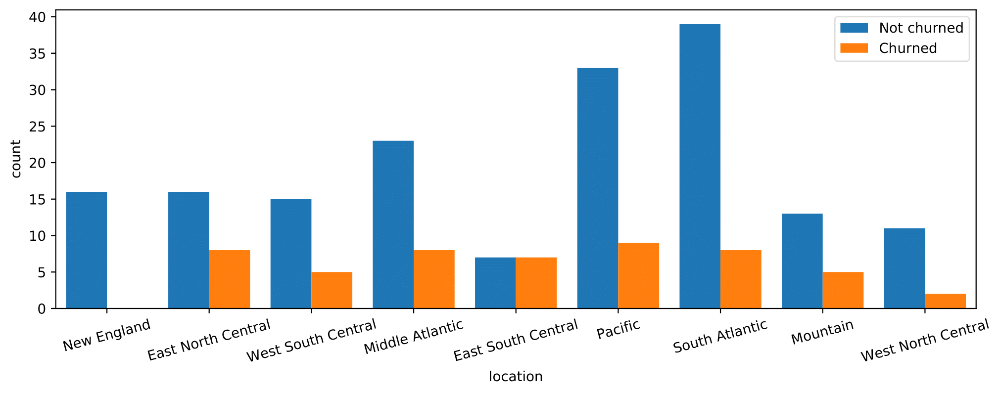
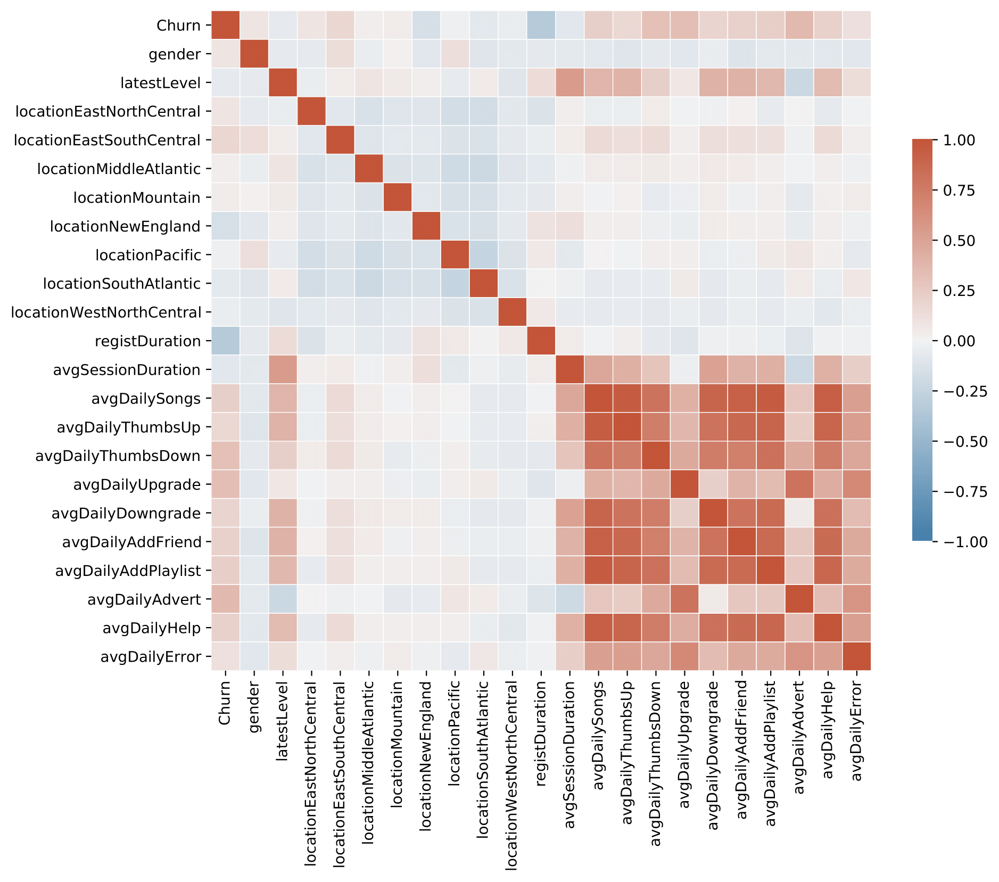
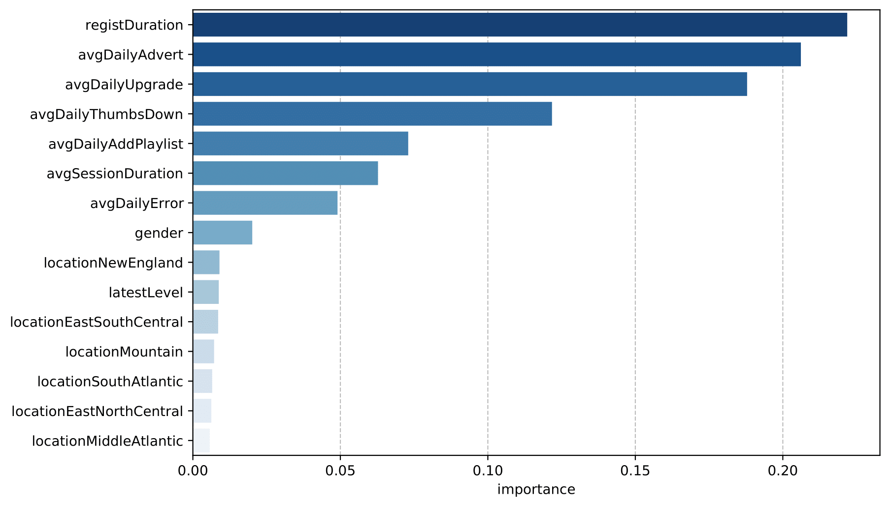

{width=100%}

Predicting customer churn is a challenging and common problem for any e-commerce business in which everything depends on the behavior of customers. Customer churn is often defined as the process in which the customers downgrade from premium to free tier or stop using the products or services of a business. Thus, the ability to predict which users are at risk of churning, while there is still time to offer them discounts or other incentives, will greatly help to prevent every custormer-facing business from suffering severe financial losses.

## Overview

- **[Data preparation](#exploratory-data-analysis)**
  - [Data description](#data-description)
  - [Data cleaning](#data-cleaning)
- **[Feature engineering and exploratory data analysis ](#feature-engineering-and-exploratory-data-analysis)**
  - [Feature correlation](#feature-correlation)
  - [Feature transformation](#feature-transformation)
- **[Modeling and evaluation](#modeling-and-evaluation)**
  - [Performance metrics](#performance-metrics)
  - [Model selection](#model-selection)
  - [Hyperparameter tuning](#hyperparameter-tuning)
  - [Feature importance](#feature-importance)
- **[Conclusion](#conclusion)**

The data set in this project is provided by Sparkify, a fictitious digital music service created by Udacity, to resemble the data sets generated by companies such as Spotify or Pandora. Millions of users stream their favorite songs through Sparkify's platform on a daily basis, either using the free tier that places advertisements between the songs or using the premiumn subscription model which is typically ad-free by paying a monthly flat rate. Users can upgrade, downgrade or cancel their service at any time. Thus, it is crucial to ensure the users love the service. Our goal in this project is to help Spakify identify potential churn users by building and training a binary classifier so as to save the business millions in revenue.

## Data preparation

Data is generated everytime a user interacts with the service while playing songs, logging out, liking a song with a thumbs up or adding a friend etc. The full dataset collects approximately 26 million records from 22277 users, whereas a smaller subset contains 286500 records from 225 users between October 1, 2018 and December 3, 2018. The model development proces present here is performed on the smaller subset using Python API for Spark, PySpark.

### Data description

Since there is no documentation provided alongside the datasets, we first have to conduct data exploration to gain a sense of the data. A detailed description of the variables is summarized below.

<center>
```{r echo=FALSE, message=FALSE, warnings=FALSE, results='asis'}
tab <- "
| Variable | Data Type | Description|
|--------- | --------- | ---------------------------------------|
|**artist**| string    | artist name   |
|**auth**  | categorical| authentication level (Logged In, Logged Out, Cancelled, Guest)|
|**firstName**| string| user’s first name|
|**gender** | categorical| user’s gender (M and F)|
|**itemInSession** |int| log count in a given session|
|**lastName** |string| user’s last name|
|**length**| double| song’s length in seconds|
|**level**| string| subscription level (free and paid)|
|**location**| string | user’s location|
|**method** |categorical| http request method (GET and PUT)|
|**page**|categorical| type of interaction (NextSong, Home, Cancellation Confirmation, etc.)|
|**registration**| int| user’s registration timestamp |
|**sessionId**|int| session to which the log belongs to |
|**song** |string| song name currently being played|
|**status** |categorical| http status code (200, 307 and 404)|
|**ts**| int| timestamp of a given log|
|**userAgent**|string| agent used by the user to access the streaming service|
|**userId**|string| user identifier|
"
cat(tab)
``` 
</center>

### Data cleaning

After checking null values, we notice variables with null values can be divided into two groups, i.e.:
* Group 1 (user-related): firstName, gender, lastName, location, registration and userAgent
* Group 2 (song-related): artist, length and song

It seems variables in each group are tied in a certain way with nulls. With more data wrangling, we find:

* When **auth** is *LoggedOut*, variable values in both groups are nulls and values in **userId** are empty strings. 
* All the rows with missing values in the **userId** column and all other user-related columns correspond to *Logged Out* or *Guest* authentication levels.
* Variable values in Group 2 are nulls whenever **page** is not *NextSong*, which makes sense since these variables are song-related.

We then remove the records when the **userId** is an empty string. Additionally, we replace the **location** column by the corresponding state name to simplify the location-related analysis. If the location links to multiple states, we select the first state to represent the user's location.
```python
def clean_data(df):
    """Clean a Sparkify dataset in the form of the Spark dataframe 
    
    Args:
    df: a Sparkify dataset
    
    Returns:
    df: a preprocessed Sparkify dataset
    """
    # remove user id with empty strings
    df = df.filter(col('userId') != '')
    
    # convert 'registration' and 'ts' to date format
    df = df \
        .withColumn('registrationTime', to_timestamp(col('registration')/1000)) \
        .withColumn('time', to_timestamp(col('ts')/1000)) 
    
    # replace location with extracted state 
    df = df \
        .withColumn('location', split(col('location'),',').getItem(1)) \
        .withColumn('location', split(col('location'), '-').getItem(0))
        
    return df
```
## Feature engineering and exploratory data analysis 

We use the *Cancellation Confirmation* events of the **page** column to define the customer churn. 
```python
userWindow = Window.partitionBy('userId').orderBy('ts').rangeBetween(Window.unboundedPreceding,Window.unboundedFollowing)

# label churned users to be 1 and unchurned users to be 0 
df = df \
    .withColumn('Churn', when(col('page')=='Cancellation Confirmation', 1).otherwise(0)) \
    .withColumn('Churn', max('Churn').over(userWindow))
```
By this definition, there are 52 churned users in a total of 225 users in the dataset. That is about 23.1% churn rate. Next, we investigate the following factors of interest for their impact on churn:

* **gender**
* **location**: user's state
* **latestLevel**: user’s latest subscription level for each user
* **registDuration**: user's registration duration (in days)
* **avgSessionDuration**: user's average session duration (in hours)
* **avgDailySongs**, **avgDailyThumbsUp**, **avgDailyThumbsDown**, **avgDailyUpgrade**, **avgDailyDowngrade**, **avgDailyAddFriend**, **avgDailyAddPlaylist**, **avgDailyAdvert**, **avgDailyHelp**, **avgDailyError**: user's average daily songs played, thumbs up given, thumbs down given, upgrades, downgrades, friends added, songs added to playlist, advertisements played, help page visits, errors encountered, respectively

In this list, only **gender** and **location** are given in the dataset and we need to engineer the rest of them.
```python
# find the latest level of each user
df = df.withColumn('latestLevel', last(col('level')).over(userWindow))

# calculate the number of days between registration to last activity 
df = df.withColumn('registDuration', ((last(col('ts')).over(userWindow)-col('registration'))/1000/3600/24).cast(IntegerType()))

# compute average session duration (in hours)
avg_session_duration_df = df \
    .groupby(['userId', 'sessionId']).agg(min(col('ts')).alias('session_start'), max(col('ts')).alias('session_end'))\
    .groupby('userId').agg(avg((col('session_end') - col('session_start'))/1000/3600).alias('avgSessionDuration'))

# define the default start and end of the observation period
obs_start_default = df.select(min(col('ts'))).collect()[0][0]
obs_end_default = df.select(max(col('ts'))).collect()[0][0]  
# compute the observation period
df = df \
    .withColumn('obs_start', when(col('registration') > obs_start_default, first(col('ts')).over(userWindow)) \
                .otherwise(obs_start_default)) \
    .withColumn('end_state', last(col('page')).over(userWindow)) \
    .withColumn('obs_end', when(col('end_state') == 'Cancellation Confirmation', last(col('ts')).over(userWindow)) \
                .otherwise(obs_end_default)) \
    .withColumn('obsDays', (col('obs_end') - col('obs_start'))/1000/3600/24)

# aggregate activity statistics
user_df = df.groupBy('userId') \
.agg(first(col('Churn')).alias('Churn'), \
     first(when(col('gender') == 'M', 1).otherwise(0)).alias('gender'), \
     first(col('location')).alias('location'), \
     first(when(col('latestLevel') == 'paid', 1).otherwise(0)).alias('latestLevel'), \
     first(col('registDuration')).alias('registDuration'), \
     first(col('obsDays')).alias('obsDays'), \
     sum(when(col('page') == 'NextSong', 1).otherwise(0)).alias('nSongs'), \
     sum(when(col('page') == 'Thumbs Up', 1).otherwise(0)).alias('nThumbsUp'), \
     sum(when(col('page') == 'Thumbs Down', 1).otherwise(0)).alias('nThumbsDown'), \
     sum(when((col('page') == 'Upgrade') | (col('page') == 'Submit Upgrade'), 1).otherwise(0)).alias('nUpgrade'), \
     sum(when((col('page') == 'Downgrade') | (col('page') == 'Submit Downgrade'), 1).otherwise(0)).alias('nDowngrade'), \
     sum(when(col('page') == 'Add Friend', 1).otherwise(0)).alias('nAddFriend'), \
     sum(when(col('page') == 'Add to Playlist', 1).otherwise(0)).alias("nAddPlaylist"), \
     sum(when(col('page') == 'Roll Advert', 1).otherwise(0)).alias('nAdvert'), \
     sum(when((col('page') == 'Help'), 1).otherwise(0)).alias('nHelp'), \
     sum(when((col('page') == 'Error'), 1).otherwise(0)).alias('nError')) \
.join(avg_session_duration_df, on='userId')

user_df = user_df \
        .withColumn('avgDailySongs', col('nSongs') / col('obsDays')) \
        .withColumn('avgDailyThumbsUp', col('nThumbsUp') / col('obsDays')) \
        .withColumn('avgDailyThumbsDown', col('nThumbsDown') / col('obsDays')) \
        .withColumn('avgDailyUpgrade', col('nUpgrade') / col('obsDays')) \
        .withColumn('avgDailyDowngrade', col('nDowngrade') / col('obsDays')) \
        .withColumn('avgDailyAddFriend', col('nAddFriend') / col('obsDays')) \
        .withColumn('avgDailyAddPlaylist', col('nAddPlaylist') / col('obsDays')) \
        .withColumn('avgDailyAdvert', col('nAdvert') / col('obsDays')) \
        .withColumn('avgDailyHelp', col('nHelp') / col('obsDays')) \
        .withColumn('avgDailyError', col('nError') / col('obsDays')) \
        .drop('obsDays', 'nSongs', 'nThumbsUp', 'nThumbsDown', 'nUpgrade', 'nDowngrade', \
              'nAddFriend', 'nAddPlaylist', 'nAdvert', 'nHelp', 'nError')
```
{width=90%}
{width=100%}

An overall look at the first three categorical feaures indicates:

* The churn rates are only slightly higher for male users and free users
* The churn rates differ greatly among 41 states. For example, NC has a very low churn rate while there are more churned users than unchurned ones in MI and MS

{width=100%}

By comparing the numerical feature distributions between churned users and unchurned ones, we have the following observations:
* Churned users have a shorter registration duration on average.
* Churned users give more thumbs down, need more help, and have to watch more advertisements per day.
* There is no significant difference between churned and unchurned users in terms of average session duration and average daily error.

### Feature correlation

Before we start modeling, we also need to understand the correlation between the response variable and the features as well as the correlation between the features. 
{width=90%}

From the heatmap above, we find

* There is a high correlation between most of the page event activities. For example, variables **avgDailySongs**, **avgDailyThumbsUp**, **avgDailyDowngrade**, **avgDailyAddFriend**, **avgDailyAddPlaylist** and **avgDailyHelp** are almost perfectly coupled. To avoid multicolinearity in the data, we only retain **avgDailyAddPlaylist** here (as it has the highest correlation with **Churn**). 

* **Churn** doesn not appear to have strong correlations with any features.  **registDuration** is negatively correlated with **Churn** while **avgDaily** has the highest positive correlation with **Churn**. It also shows that **gender**, **latestLevel**, **avgSessionDuration** and **avgDailyError** all have very low correlation with **Churn**. This is consistent with our previous findings through direct visualization. However, the Pearson correlation assumes a linear relationship, and a low correlation simply means that there is no linear relationship between these features and the response variable. The data might still have a nonlinear relationship and should be included in the modeling for now. 

### Feature transformation

Spark MLlib requires that the features are formatted as a single vector. Therefore, we create a data pipeline using Spark's **Pipeline** function to transfrom and vectorize features before we feed them into training. The steps involved in this pipeline include: 
* One hot encode **location** by dummy binary columns
* Scale each numberical feature within the range [0,1] 
* Assemble all features into one vector column

Now a vector of 49 features is ready to be used for modeling. 

## Modeling and evaluation

We randomly split the entire dataset into a training set, a validation set and a test set in 6:2:2 ratio using stratified sampling based on **Churn**. Using Spark's **sampleBy** function, the training, validation and test set now consists of 161, 20 and 44 users, respectively. Notice the training and validation set do not follow a 75/25 split since Spark's sampleBy function does not guarantee an exact split to the weights (fluctuations often happen if number of records is low). It only guarantees that each object has equal probability to be assigned to a specific subset.

### Performance metrics

We choose to use the **f1 score** as a performance metric since our dataset is imbalanced. Another metric we look at is the **area under the precision-recall curve (AUC-PR)**. For binary classifier evaluation, precision-recall curves are more useful in practice than the receiver operating characteristic (ROC) curves for problems where the "positive" class is more of interest than the negative class. See: http://pages.cs.wisc.edu/~jdavis/davisgoadrichcamera2.pdf 

### Model selection

We select three binary classifiers supported in Spark as candidate models: logistic regression, random forest classifier and gradient-boosted tree classifier. Both random forest and gradient-boosted techniques employ an ensemble of decision trees (base estimators) to improve the predictive capability over a single estimator. The difference is random forest builds several estimators independently and then average their predictions, while gradient-boosted tree buils base estimators sequentially to generate a powerful ensemble. The predictions from the three models on the validation set without tuning are demonstrated below:

<center>
```{r echo=FALSE, message=FALSE, warnings=FALSE, results='asis'}
t <- "
|Classifier | F1 score | AUC-PR | Training time (s) |
|---------| --------- | --------- | --------- |
|Logistic regression| 0.659|0.128| 130.8|
|Random forest classifier| 0.811 | 0.460 | 67.0|
|Gradient-boosted tree classifier|0.760| 0.502 | 267.9 |
"
cat(t)
```
</center>

The results show that the random forest classifier outperforms both the logistic regression model and the gradient-boosted tree classifier in terms of f1 score and training time. The gradient-boosted tree classifier only performs marginally better than the random forest classifer in AUC-PR. As aforementioned, the features and the response variable do not follow a linear relationship, which suggest that a non-linear model might be more suited to the data.

### Hyperparameter tuning

We decide to tune the random forest model to see if we can improve it further. We performe a grid search with 4-fold cross validation to test the performance of several parameter combinations.
```python
# set hyperparameters for tuning
paramGrid = ParamGridBuilder() \
            .addGrid(rf.numTrees, [20, 40]) \
            .addGrid(rf.maxDepth, [4, 5, 6]) \
            .build()  

# grid search with cross validation    
crossval = CrossValidator(estimator = rf,
                          estimatorParamMaps = paramGrid,
                          evaluator = MulticlassClassificationEvaluator(labelCol='Churn', metricName='f1'),
                          numFolds = 4)

cv_rf = crossval.fit(train_val)
test_prediction = cv_rf.transform(test)

f1_score_evaluator = MulticlassClassificationEvaluator(labelCol='Churn', metricName='f1')
f1_score = f1_score_evaluator.evaluate(test_prediction.select('Churn', 'prediction'))

auc_evaluator = BinaryClassificationEvaluator(labelCol='Churn')
auc_pr = auc_evaluator.evaluate(test_prediction, {auc_evaluator.metricName:'areaUnderPR'})
```

<center>
```{r echo=FALSE, message=FALSE, warnings=FALSE, results='asis'}
t2 <- "
|maxDepth	| numTrees | F1 score |
| --------- | --------- | --------- | 
|4	|20|	0.812|
|5	|20|	0.808|
|6	|20|	0.814|
|4	|40|	0.802|
|5  |40|	0.826|
|6	|40|  0.806|
"
cat(t2)
```
</center>

The best model is achieved at maxDepth=5 and numTrees=40. We apply this model to the test set, and we obtain a improved **f1 score** of **0.830** and **AUC-PR** of **0.731**. 

### Feature importance
To gain a better understanding of the feature attributes to the model in predicting user churn, we extract feature importances from the trained model.
```python
# map features from the output of VectorAssembler back to the column names
attr_dict = test_prediction.schema['features'].metadata['ml_attr']['attrs']

# rename categorical columns
bin_attrs = [[attr["idx"], attr["name"]] for attr in attr_dict['binary']]
for bin_attr in bin_attrs:
    name_split = bin_attr[1].split('_')
    if name_split[0] == 'location':
        bin_attr[1] = name_split[0] + name_split[-1]
    else:
        bin_attr[1] = name_split[0]
        
# rename numerical columns
num_attrs = [[attr["idx"], attr["name"]] for attr in attr_dict['numeric']] 
num_attrs = [[num_attr[0], num_cols[i]] for i, num_attr in enumerate(num_attrs)]

features = [attr[1] for attr in bin_attrs + num_attrs]
importances = list(cv_rf.bestModel.featureImportances)
```

{width=80%}

It can be seen that the most important feature for identifying churned users is the registration duration which makes sense since it directly reflects a user's willness to stay with the service. Besides, average upgrades and thumbs down given per day that represent a user's strong inclination also play major roles in churn prediction. Another influential feature that helps churn detection is avarage daily advertisements. Intuitively, the more advertisements a user has to watch, the more likely he/she is dissatisfied with the service. 

The result also shows that gender, latest subscription level and each one-hot encoded location feature contribute little to predicting churned users. Nevertheless, we notice that all the top location features have much higher churn rates than the average churn rate.

## Conclusion

In this project, we manage to build a RF classifier that can accurately identify churned users. Since the dataset is relatively clean, the most critical step in the model development process is feature engineering. It has been proved most of the engineered features based on user behaviors play vital roles in churn prediction. For further imporvements, we can test more engineered features that capture the  insights about users' activity patterns and trends. In addtion, a latent issue with our current modeling is that we have 49 features for a dataset with only 225 sample, which may potentially cause the curse of dimensionality. From the analysis of feature importance, we can safely reduce the number of features by discarding most of encoded location featues before feeding them into the model.

