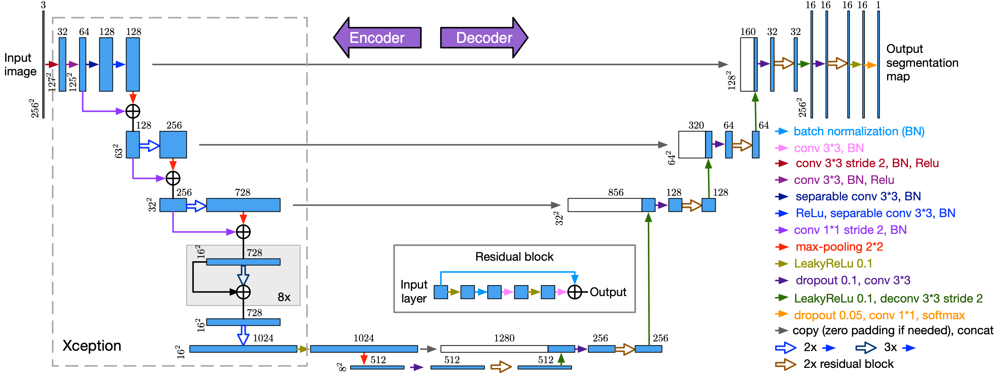
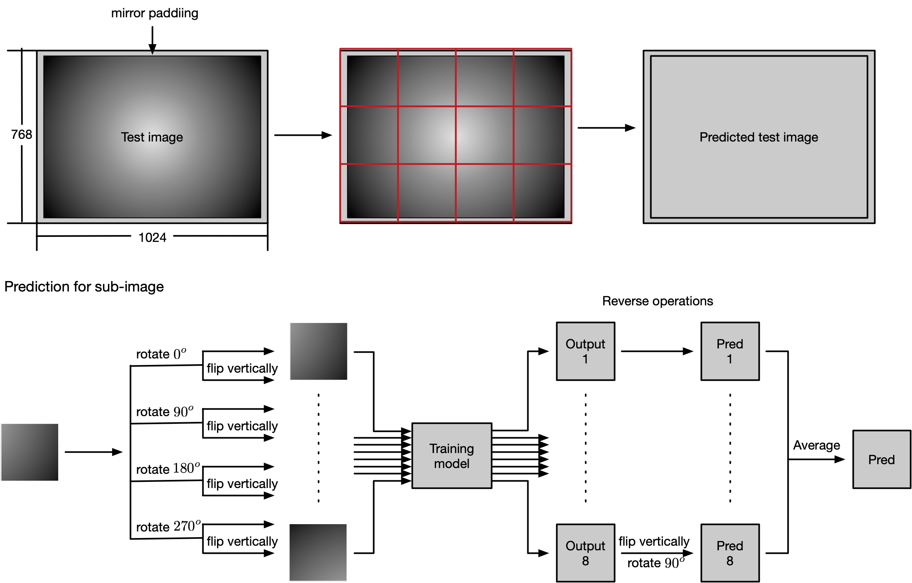

---
authors:
- Wei Guo, Ekta U. Samani, Agnes Blom-Schieber and Ashis G. Banerjee 
date: "2019-12-15T00:00:00Z"
external_link: ""
links:
- icon: university
  icon_pack: fas
  name: BARC website
  url: https://depts.washington.edu/barc/projects/data-science-manufacturing
- icon: github
  icon_pack: fab
  name: code
  url: https://github.com/w-guo/Boeing-AFP-ML

# slides: example
summary: Improved tow-end recognition for fiber placement inspection using deep learning.
tags:
- Deep Learning
- Semantic segmentation
title: Deep Learning for Automated In-Process Inspection of Composite Layup
url_code: ""
url_pdf: ""
url_slides: ""
url_video: ""
---

One important step in automated fiber placement (AFP) manufacturing systems is the inspection of composite ply boundary, including the accuracy of tow ends placement. The automated inspection system currently in use identifies about 88% tow ends correctly and requires manual effort to recognize the remaining ones. Thus, the goal of this project is to improve the accuracy of tow ends identification to further reduce the production time. We propose a deep learning-based semantic segmentation method to detect the tow ends. Our method achieves 99% tow end detection accuracy with prediction times of ~0.1s per tow. 

## Overview

- **[Experimental setup](#experimental-setup)**
  - [Generate training and testing sets](#generate-training-and-testing-sets)
  - [Training set augmentation](#training-set-augmentation)
  - [Image pre-processing](#image-pre-processing)
- **[Train the model](#train-the-model)**
  - [1st stage training](#1st-stage-training)
  - [2nd stage training](#2nd-stage-training)
- **[Predict the testing set](#predict-the-testing-set)**
- **[Post-processing](#post-processing)**
- **[Results](#results)**

The major highlights of this work are:

- After sub-images are randomly extracted from the full images, since it is difficult to distingush sub-images with full pixels labeled as class 1 from those with full pixels labeled as class 0 without a larger context, we relabel those sub-images with full pixels labeled as class 1 to class 0 so that sub-images with only one class of pixels have the same labels. In this manner, the training model only needs to learn to recoginize the sub-images that contain the class boundaries and those that do not.

- The major changes we have made on the original U-Net architecture includes the use of pre-trianed Xception model from ImageNet as the encoder and the replacement of the second convolutional layer in each level of decoder with two residual blocks.

- We adopt normalized SGD optimizer during the training, which greatly shortens the training time. The basic idea of normalized gradient optimizer is to normalize each layer of the mini-batch stochastic gradient. It has been shown that the normalized gradient methods having constant step size with occasionally decay (e.g., SGD with momentum) often outperform the optimizers with adaptive step sizes, such as Adam.

- Instead of generating binary images with a threshold to determine the class boundaries, we extract line segments directly from the grayscale images transformed from the prediction of the training model.

## Experimental setup

### Generate training and testing sets

First, we split the images in a 90:10 ratio randomly for training and testing.

### Training set augmentation

The training of the neural network is performed on sub-images randomly extracted from full training images. Each full training image is sampled repeatedly to generate a training set size of ~100k. Each sampled sub-image is then randomly chosen to follow one of the four 90$^o$ rotations or undergo reflection about vertical central axis. At last, we relabel the sub-images with full pixels labeled as class 1 to class 0 (see [gen_img_aug.py](https://github.com/w-guo/Boeing-AFP-ML/blob/master/src/utils/gen_img_aug.py)).

### Image pre-processing

Before training, each sub-image is pre-processed through the following steps (see [pre-processing.py](https://github.com/w-guo/Boeing-AFP-ML/blob/master/src/pre_processing.py)): 
* Gray-scale conversion
* Standardization
* Histogram equalization
* Gamma correction 

Due to the limited memory of the computer, we cannot fit all the images into it at one time. Thus, [Welford's online algorithm for streaming data](https://github.com/liyanage/python-modules/blob/master/running_stats.py) is adopted here to calcute mean and standard deviation across all the sub-images in the training set. Among these steps, histogram equalization enhances the global contrast of the images and Gamma correction adjusts the brightness of the images. It is worth noting that histogram equalization plays a critical role in the pre-processing step. Our experiment shows that the result from applying it to random training images is inferior to the result from applying it to all training images. 

## Train the model

Through stratified sampling based on the coverage of class 1, 20% of the sub-images in the training set are selected to form the validation set.

    
    <em> CNN model derived from U-Net</em>

### 1st stage training

* Optimizer: Normalized SGD with cosine annealing learning rate starting from 0.001
* Loss function: 0.5$\times$ binary cross-entropy loss + 0.5$\times$ Dice loss
* Batch size: 32

Since a mini-batch with size of 32 cannot be fed into our GPU (GeForce GTX 1080) directly due to its limited memory (8 GB), we set the acutal mini-batch size to be 8. However, we do not update parameters until we acccumulate four mini-batches.[^Keras] 

### 2nd stage training

The only difference compared to the 1st stage training is that [Lovasz-Softmax loss](https://github.com/bermanmaxim/LovaszSoftmax) is used as the loss function in this stage. Lovasz-Softmax loss is develped based on the convex Lovasz extension of submodular set functions. As a piecewise linear convex surrogate to the mean IoU loss, it has been shown that Lovasz-Softmax loss consistently outperforms the traditionally used cross-entropy loss with respect to the mean IoU measure.[^Lovasz-Softmax] 

## Predict the testing set

In this work, we assume we have no prior knowledge about the expected centers and orientation of tow ends given a camara image of composite ply layers. 

    
    <em> Image reconstruction</em>

## Post-processing

1. Convert prediction to gray scale image (probability x 255) for each pixel 
2. Extract line segments based on contrast(no binarization!)
3. Determine major polylines formed by line segments as the boundary

## Results

    
    <em> An example of automatically detected tow boundaries during in-process inspection of composite parts</em>

[^Keras]: A Keras implementation can be found here: [https://github.com/keras-team/keras/issues/3556](https://github.com/keras-team/keras/issues/3556), which requires the revision of both *optimizers.py* files residing in ../site-packages/keras/optimizers.py and ../site-packages/tensorflow/python/keras/optimizers.py.

[^Lovasz-Softmax]: In fact, Lovasz-Softmax loss can be used to train the model from the beginning. The only downside is its trainig time for each epoch is about three times as long as that during the 1st stage.