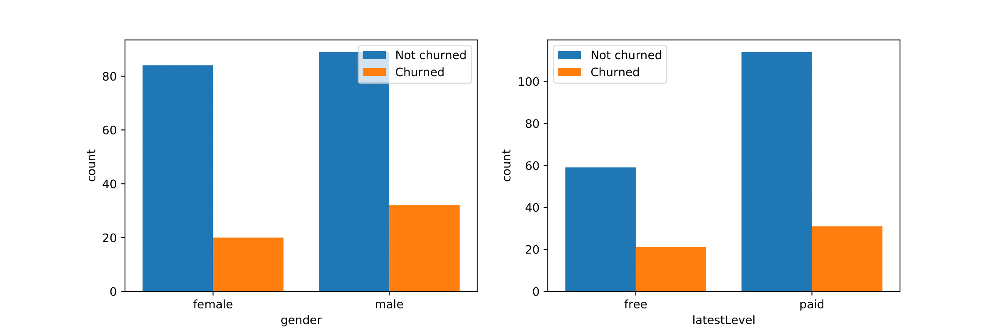
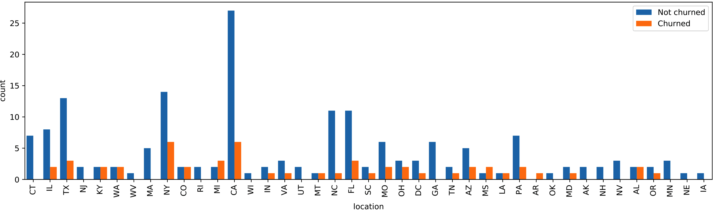
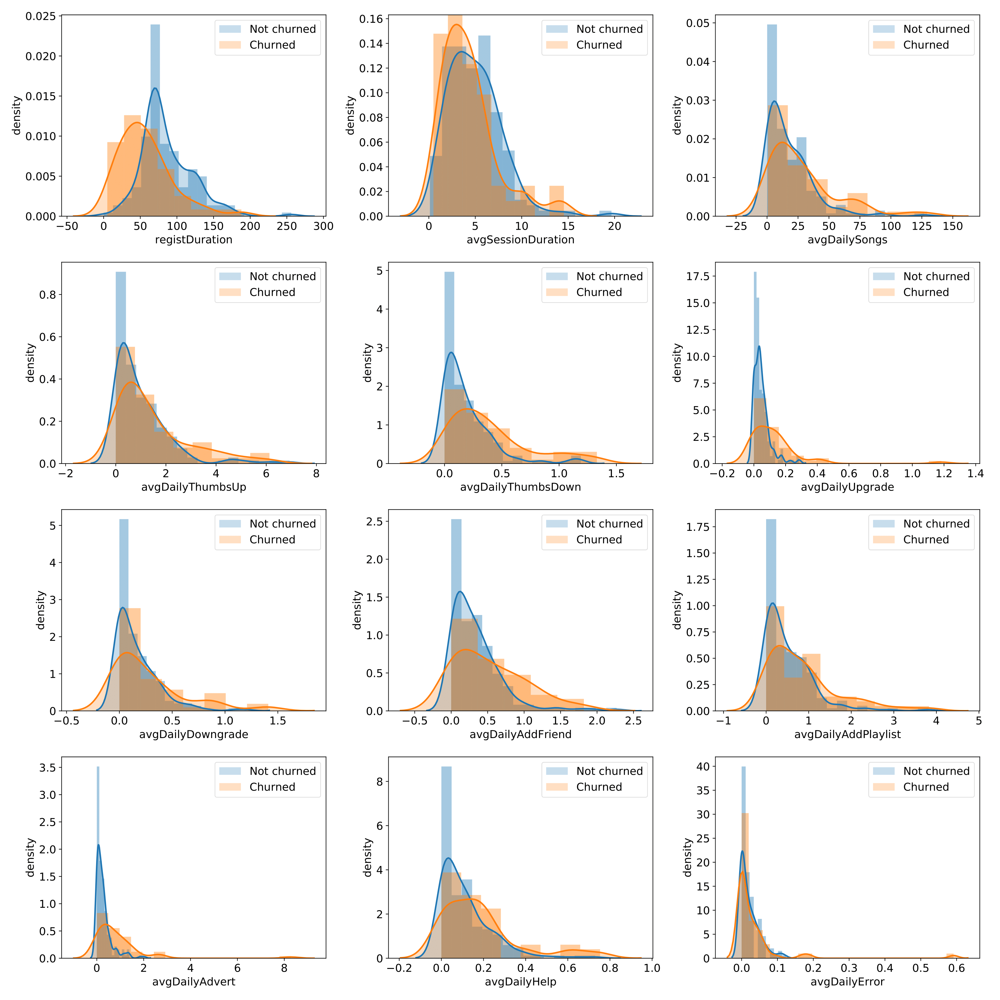
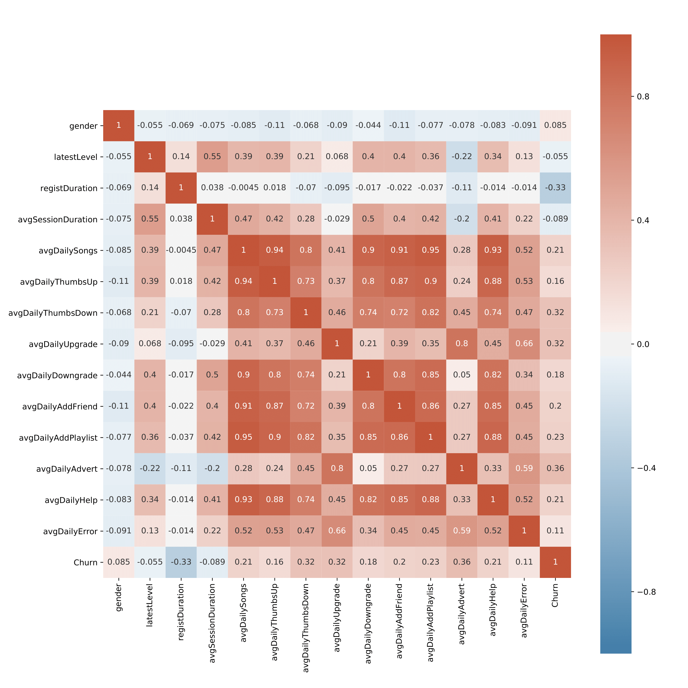
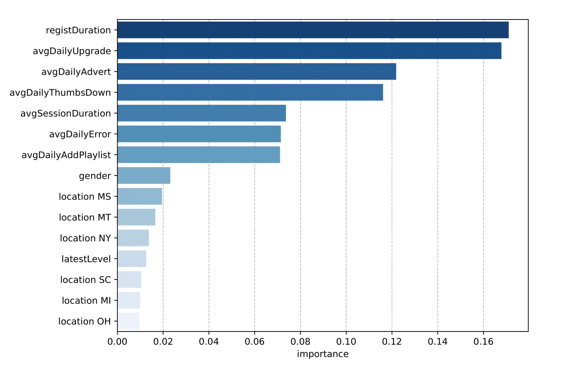

---
authors:
- Wei Guo 
date: "2020-10-31T00:00:00Z"
external_link: ""
links:
- icon: github
  icon_pack: fab
  name: code
  url: https://github.com/w-guo/Boeing-AFP-ML

# slides: example
summary: Explore the capabilities of Apache Spark's analytics engine for large-scale data processing to detect churn customers.
tags:
- Machine learning
- Spark
title: Customer Churn Prediction using PySpark
url_code: ""
url_pdf: ""
url_slides: ""
url_video: ""
---

Predicting customer churn is a challenging and common problem for any e-commerce business in which everything depends on the behavior of customers. Customer churn is often defined as the process in which the customers downgrade from premium to free tier or stop using the products or services of a business. Thus, the ability to predict which users are at risk of churning, while there is still time to offer them discounts or other incentives, will greatly help to prevent every custormer-facing business from suffering severe financial losses.
## Overview

- **[Exploratory data analysis](#exploratory-data-analysis)**
  - [Data description](#data-description)
  - [Data cleaning](#data-cleaning)
- **[Feature engineering](#feature-engineering)**
- **[Modeling and evaluation](#modeling-and-evaluation)**
  - [Performance metrics](#performance-metrics)
  - [Hyperparameter tuning](#hyperparameter-tuning)
- **[Conclusion](#conclusion)**

The data set in this project is provided by Sparkify, a fictitious digital music service created by Udacity, to resemble the data sets generated by companies such as Spotify or Pandora. Millions of users stream their favorite songs through Sparkify's platform on a daily basis, either using the free tier that places advertisements between the songs or using the premiumn subscription model which is typically ad-free by paying a monthly flat rate. Users can upgrade, downgrade or cancel their service at any time. Thus, it is crucial to ensure the users love the service. Our goal in this project is to help Spakify identify potential churn users by building and training a binary classifier so as to save the business millions in revenue.

## Exploratory data analysis

Data is generated everytime a user interacts with the service while playing songs, logging out, liking a song with a thumbs up or adding a friend etc. The full dataset consists of approximately 26 million records from 22277 users, whereas a smaller subset contains 286500 records from 225 users between October 1, 2018 and December 3, 2018. The model development proces present here is performed on the smaller subset using Python API for Spark, PySpark.

### Data description

Since there is no documentation provided alongside the datasets, we first have to conduct data exploration to gain a sense of the data. A detailed description of the variables is summarized below.

Variable | Data Type | Description
--- | --- | ---
**artist**| string| artist name
**auth**| categorical| authentication level (Logged In, Logged Out, Cancelled, Guest)
**firstName**| string| user’s first name
**gender** | categorical| user’s gender (M and F)
**itemInSession** |int| log count in a given session
**lastName** |string| user’s last name
**length**| double| song’s length in seconds
**level**| string| subscription level (free and paid)
**location**| string | user’s location
**method** |categorical| http request method (GET and PUT)
**page**|categorical| type of interaction (NextSong, Home, Cancellation Confirmation, etc.)
**registration**| int| user’s registration timestamp
**sessionId**|int| session to which the log belongs to
**song** |string| song name currently being played
**status** |categorical| http status code (200, 307 and 404)
**ts**| int| timestamp of a given log
**userAgent**|string| agent used by the user to access the streaming service
**userId**|string| user identifier

### Data cleaning

After checking null values, we notice variables with null values can be divided into two groups, i.e.:
* Group 1 (user-related): firstName, gender, lastName, location, registration and userAgent
* Group 2 (song-related): artist, length and song

we find:
* When **auth** is *LoggedOut*, variables in both groups are null and **userId** is an empty string. 
* All the rows with missing values in the **userId** column and all other user-related columns correspond to *Logged Out* or *Guest* authentication levels.
* Variables in Group 2 are null whenever **page** is not *NextSong*, which makes sense since these variables are song-related.

## Exploratory data analysis

We use the *Cancellation Confirmation* events of page column to define the customer churn. There are 52 churned users in a total of 225 users in the dataset. That's about 23.1% churn rate.

    

    

We find:
* The churn rates are only slightly higher for male users and free users
* The churn rates differ greatly among 41 states. For example, NC has a very low churn rate while there are more churned users than unchurned ones in MI and MS

## Feature engineering

    

We find:

* Churned users have a shorter registration duration on average.
* Churned users give more thumbs down, need more help, and have to watch more advertisements per day.
* There is no significant difference between churned and unchurned users in terms of average session duration and average daily error.

Before we start modeling, we need to understand the correlation between the count variable and the input variables (features) as well as the correlation between the input variables. 

    

From the heatmap above, we find

* There is a high correlation between most of the page event activities. For example, variables **avgDailySongs**, **avgDailyThumbsUp**, **avgDailyDowngrade**, **avgDailyAddFriend**, **avgDailyAddPlaylist** and **avgDailyHelp** are almost perfectly correlated. To avoid multicolinearity in the data, we only retain **avgDailyAddPlaylist** here (as it has the highest correlation with **Churn**). 

* **Churn** doesn not appear to have strong correlations with any features.  **registDuration** is negatively correlated with **Churn** while **avgDaily** has the highest positive correlation with **Churn**. It also shows that **gender**, **latestLevel**, **avgSessionDuration** and **avgDailyError** all have very low correlation with **Churn**. This is consistent with our previous findings through direct visualization. However, the Pearson correlation assumes a linear relationship, and a low correlation simply means that there is no linear relationship between these features and the response variable. The data might still have a nonlinear relationship and should be included in the modeling for now. 

## Modeling and evaluation

### Performance metrics

We choose to use the **f1 score** as a performance metric since our dataset is imbalanced. Another metric we look at is the **area under the precision-recall curve (AUC-PR)**. For binary classifier evaluation, precision-recall curves are more useful in practice than the receiver operating characteristic (ROC) curves for problems where the "positive" class is more of interest than the negative class. See: http://pages.cs.wisc.edu/~jdavis/davisgoadrichcamera2.pdf 

    

## Conclusion